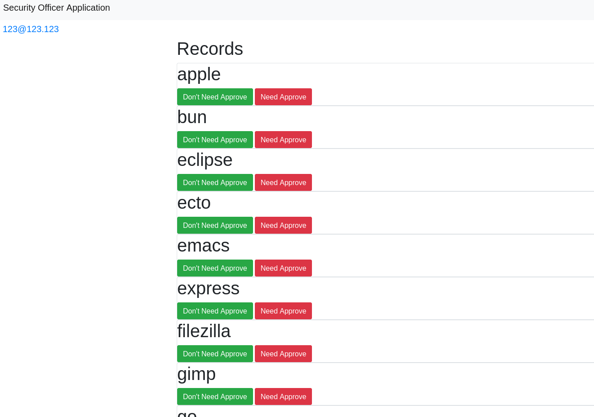

# lms-project2

Application store for an import-independent corporate environment (Linux).
Allows installation of certain software with user rights.
Works via a system service (systemd unit). The user is limited by a "white" list of software.

## Scheme

## White list

The corporate web server acts as an arbitrator. The web server filters POST requests, removing software not from the white list,
the system service on the user's PC executes tasks only from the web server. The identifier is the computer name,
the user name is saved in the request for installing flatpak packages at the user level.

## Screen

